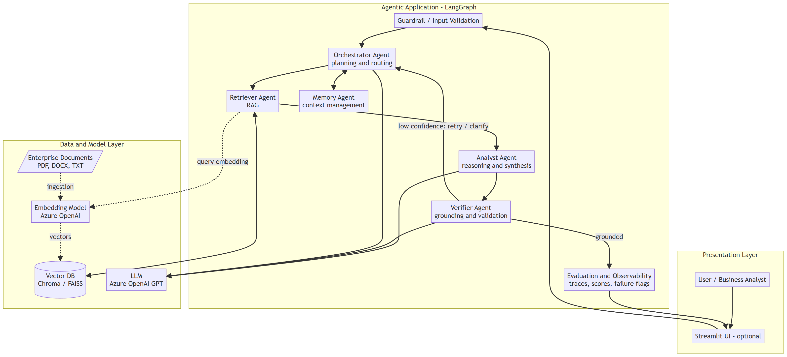

# Enterprise Knowledge Ops Agent

A local, **multi-agent Agentic AI system** that answers complex enterprise questions by
reasoning across multiple documents — built with **LangGraph**. It goes beyond a basic RAG
chatbot: a team of specialized agents *plans*, *retrieves*, *reasons*, *validates*, and
*explains*, with full decision tracing, source-grounded answers, and self-evaluation.

> Cognizant Skillspring case study — *Agentic AI Developer: Enterprise Knowledge Ops Agent*
> Skill tower: **Open Source / LangGraph + AWS**



## Why this is "agentic" and not just RAG

| Basic RAG chatbot | This system |
|-------------------|-------------|
| Single retrieve → answer | Orchestrator **plans** multi-step work, routes subtasks |
| One model does everything | **5 specialized agents** with distinct roles |
| Answers, no verification | **Verifier** grounds every claim; flags low confidence |
| Opaque | **Decision trace + evaluation report** for every answer |
| Hallucinates when unsure | **Abstains** with a disclaimer when evidence is weak |

## The five agents

| Agent | Responsibility |
|-------|----------------|
| **Orchestrator** | Plans the work — decomposes the query into ordered subtasks and routes them |
| **Retriever** | RAG — fetches the most relevant document chunks (with scores + sources) |
| **Analyst** | Reasons across chunks and synthesizes a cross-document answer |
| **Verifier** | Checks grounding claim-by-claim; flags/limits low-confidence output |
| **Memory** | Carries query, plan, and intermediate findings across the run |

## Tech stack

Python · LangChain · **LangGraph** · **AWS Bedrock** (default) or Azure OpenAI (chat + embeddings) ·
**Chroma** (vector DB) · Guardrails · **Streamlit** (UI) · AWS (deployment)

### Model provider

The model layer supports two providers via `LLM_PROVIDER` in `.env`:

| Provider | Chat | Embeddings | Notes |
|----------|------|------------|-------|
| `bedrock` (default) | Anthropic Claude on Bedrock | Amazon Titan / Cohere | AWS-native; fits the LangGraph + AWS tower |
| `azure` | Azure OpenAI GPT | Azure OpenAI embeddings | Alternative if you have Azure access |

Only [src/llm.py](src/llm.py) (chat) and [src/ingestion/index.py](src/ingestion/index.py)
(embeddings) know about providers — everything else is provider-agnostic. **Bedrock setup:**
enable model access in the Bedrock console, ensure `bedrock:InvokeModel` IAM permission, and
configure credentials (env keys, or leave blank to use the boto3 default chain / SSO / role).

## Documentation

**New here?** Follow [GETTING_STARTED.md](GETTING_STARTED.md) for setup, adding documents,
building the index, and running the app.

Full design docs live in [docs/](docs/). Start with the [docs index](docs/README.md).

| Doc | Topic |
|-----|-------|
| [Getting started](GETTING_STARTED.md) | Local setup, documents, ingestion, run commands |
| [Submission summary](docs/00_submission_summary.md) | Rubric + user-story mapping, deliverables checklist |
| [01 Architecture](docs/01_architecture.md) | System design, agents, repo layout, shared state |
| [02 Agent flow](docs/02_agent_flow.md) | How a query flows through the LangGraph state machine |
| [03 Implementation plan](docs/03_implementation_plan.md) | Phased, step-by-step build plan |
| [04 Evaluation & guardrails](docs/04_evaluation_and_guardrails.md) | Grounding, guardrails, failure detection |
| [05 Unit test plan](docs/05_unit_test_plan.md) | Test cases per component |
| [06 Corpus guide](docs/06_corpus_guide.md) | The 13-policy document set + demo queries |

Diagrams as image files: [docs/diagrams/](docs/diagrams/) (SVG + PNG; open `index.html` for a gallery).

## Repository layout

```
├── Policies/                  # source documents (add your own PDFs here)
├── data/vectorstore/          # persisted Chroma index (generated)
├── docs/                      # design documentation + diagrams
├── src/                       # application code (agents, graph, guardrails, evaluation)
├── ui/                        # optional Streamlit UI
├── tests/                     # pytest suite
├── tools/                     # utilities (e.g. diagram export)
├── GETTING_STARTED.md         # local setup guide (start here)
├── requirements.txt
└── README.md
```

## Setup

See **[GETTING_STARTED.md](GETTING_STARTED.md)** for the full walkthrough (venv, `.env`,
adding PDFs to `Policies/`, building the index, CLI, and Streamlit). Summary:

```bash
python -m venv .venv          # then activate it
python -m pip install -r requirements.txt
cp .env.example .env          # Windows: Copy-Item .env.example .env
# add your PDFs to Policies/
python tools/check_model.py
python -m src.ingestion.index --rebuild
python -m src.app "your question" --trace
```

`.env` keys (Bedrock default — see `.env.example` for the full list incl. Azure):

```
LLM_PROVIDER=bedrock
AWS_REGION=us-east-1
AWS_ACCESS_KEY_ID=          # blank -> use boto3 default chain (SSO / role / env)
AWS_SECRET_ACCESS_KEY=
AWS_SESSION_TOKEN=          # required for temporary / lab credentials
BEDROCK_CHAT_MODEL_ID=us.anthropic.claude-sonnet-4-5-20250929-v1:0
BEDROCK_EMBED_MODEL_ID=amazon.titan-embed-text-v2:0
```

### Credentials (AWS Bedrock)

AWS does not use a single "API key" string. Authentication is a **set of values** that
together act as your key — `boto3` signs every Bedrock request with them:

| Value | Meaning |
|-------|---------|
| `AWS_ACCESS_KEY_ID` | identifies the principal |
| `AWS_SECRET_ACCESS_KEY` | the secret (treat like a password) |
| `AWS_SESSION_TOKEN` | required for **temporary** credentials (SSO, assumed roles, lab sandboxes) |

You may leave all three blank to use the boto3 **default credential chain** (env vars,
`~/.aws/credentials`, SSO, or an IAM role) instead.

**Two ways to authenticate** (both supported, no code change):

| | Long-term IAM user key (recommended) | Temporary credentials |
|---|---|---|
| Values | access key + secret (`AWS_SESSION_TOKEN` blank) | access key + secret + **session token** |
| Expiry | none (until you rotate/delete it) | ~1 hour (must be refreshed) |
| Get it | IAM → Users → create user → attach `AmazonBedrockFullAccess` → Security credentials → Create access key | SSO / assumed role / lab sandbox (e.g. MakeMyLabs) |

The long-term IAM key avoids the ~1-hour expiry, so it's the smoother choice for sustained
work. Set the access key + secret and **leave `AWS_SESSION_TOKEN` blank**. (Lab sandboxes
sometimes block IAM user creation — if so, fall back to the temporary credentials.)

🔒 Long-term keys do not auto-expire — never commit them (`.env` is git-ignored), and delete
the IAM user when the project is done.

**Finding the right model id:** run `python tools\list_bedrock_models.py` to list the
**ACTIVE** models in your region. Models marked `[INFERENCE_PROFILE]` (most current Claude
models) must be invoked by their inference-profile id, e.g.
`us.anthropic.claude-sonnet-4-5-20250929-v1:0` — not the bare `anthropic.claude-...` id.
First-time use of Anthropic models may require submitting a short use-case form in the console.

**Verify access** before building the index: `python tools\check_model.py` calls the chat and
embedding models once and reports success or the exact error.

> ⏳ **Temporary credentials expire.** Lab/sandbox (e.g. MakeMyLabs) and SSO credentials are
> time-limited. When calls start returning `AccessDenied` / `ExpiredToken`, generate fresh
> credentials, re-paste the three `AWS_*` values into `.env`, and restart the app — nothing
> else changes.

## Usage

See [GETTING_STARTED.md](GETTING_STARTED.md) §7 for CLI and Streamlit commands. Quick examples
(with your virtual environment activated):

```bash
python -m src.ingestion.index --rebuild
python -m src.app "Can a former employee who resigned be rehired?" --trace
streamlit run ui/streamlit_app.py
```

> Each run writes a structured trace + evaluation report to `logs/trace_<timestamp>.json`. See
> the [implementation plan](docs/03_implementation_plan.md) for how each phase maps to the code.

## Testing

```bash
python -m pytest -q
python -m pytest --cov=src --cov-report=term-missing
```

See the [unit test plan](docs/05_unit_test_plan.md) for the full case list.

## Regenerating the diagrams

```powershell
& ".\.venv\Scripts\python.exe" tools\export_diagrams.py
```

Renders every Mermaid block in `docs/*.md` to SVG + PNG in `docs/diagrams/`, using the
system-installed Microsoft Edge (so it works behind the corporate proxy).

## Scope

**In scope:** local agentic system, multi-document reasoning, validation/grounding,
guardrails, evaluation, observability.
**Out of scope (per brief):** cloud/production deployment, authentication/access control,
model training/fine-tuning, advanced frontend.
