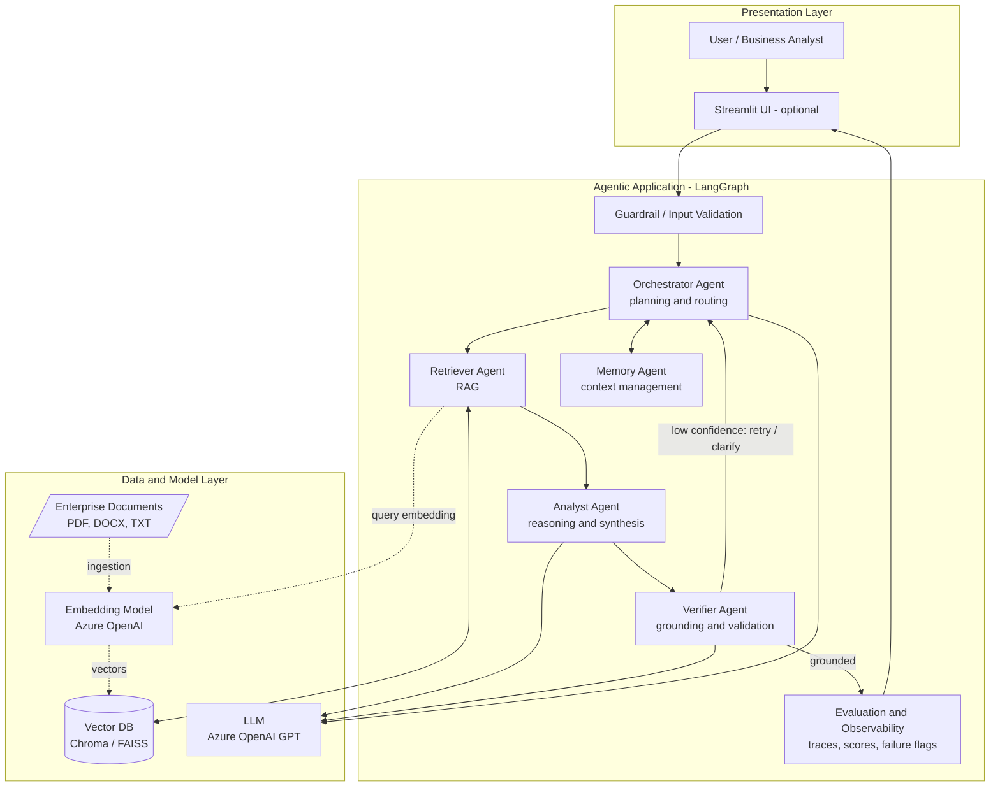

# 1. System Architecture

## 1.1 Design goal

Move beyond a single "RAG chatbot" to a **coordinated multi-agent system**. Each agent has
one clear responsibility, the orchestration between them is **explicit** (not implicit), and
every decision is **traceable**. This directly targets the "Excellent (16–20)" band of the
Agentic Architecture rubric.

## 1.2 High-level component view



> Rendered image: [diagrams/01_architecture_1.png](diagrams/01_architecture_1.png) ([SVG](diagrams/01_architecture_1.svg))
>
> 

## 1.3 The five agents and their responsibilities

| Agent | Single responsibility | Key inputs | Key outputs | Tools / models |
|-------|----------------------|------------|-------------|----------------|
| **Orchestrator** | Plan the work: decompose the query into ordered sub-questions and decide routing. Re-plan if the Verifier rejects. | User query, memory | Plan (list of subtasks), routing decisions | LLM (planning prompt) |
| **Retriever** | For each subtask, fetch the most relevant document chunks and preserve their metadata/source. | Subtask text | Ranked chunks + relevance scores + source metadata | Vector DB, embeddings |
| **Analyst** | Reason **across** the retrieved chunks and synthesize a coherent, multi-document answer. | Subtask + retrieved chunks | Draft answer + reasoning summary + cited chunk IDs | LLM (reasoning prompt) |
| **Verifier** | Check that each claim is supported by the cited sources. Produce a grounding score; flag/limit if low. | Draft answer + sources | Verdict (pass/flag), grounding score, list of unsupported claims | LLM (NLI-style check) |
| **Memory** | Hold short-term context: original query, plan, intermediate sub-answers, prior conversation turns. | All agent events | Context bundle handed to each agent | State store (LangGraph state + optional persistence) |

## 1.4 Why these boundaries matter

- **No overlap** — the Analyst never retrieves; the Retriever never reasons; the Verifier
  never invents content. Clean separation is what the rubric calls "distinct roles."
- **Explicit orchestration** — the Orchestrator is a real node that emits a plan object, not
  a hidden prompt instruction. The plan is logged and inspectable.
- **A feedback loop exists** — the Verifier can send control *back* to the Orchestrator
  (re-plan / re-retrieve / ask for clarification). This is the difference between linear
  pipeline execution (Good band) and genuine agentic control flow (Excellent band).

## 1.5 Technology choices

| Concern | Choice | Why |
|---------|--------|-----|
| Orchestration | **LangGraph** | Stateful graph with nodes, conditional edges, and loops — models multi-agent control flow natively. |
| LLM + embeddings | **Azure OpenAI** | Per the syllabus; one provider for chat + embeddings. |
| Vector DB | **Chroma** (default) / FAISS | Chroma is local, persistent, zero-infra. FAISS if pure in-memory speed is wanted. |
| Doc loading / chunking | **LangChain** loaders + splitters | Mature loaders for PDF/DOCX/TXT, recursive chunking. |
| UI | **Streamlit** (optional) | Fast way to expose answer + sources + trace/eval panel. |
| Deployment | **AWS** (EC2 / App Runner / ECS) | Per the tower; out of scope for grading but documented. |
| Config / secrets | `.env` + `pydantic-settings` | Keep Azure keys out of code. |

## 1.6 Proposed repository layout

```
Solution1/
├── docs/                      # this documentation
├── Policies/                  # source enterprise documents (the 13 policy PDFs)
├── data/
│   └── vectorstore/           # persisted Chroma DB
├── src/
│   ├── config.py              # settings, env, model names
│   ├── ingestion/
│   │   ├── loader.py          # load + chunk documents
│   │   └── index.py           # embed + write to vector DB
│   ├── agents/
│   │   ├── orchestrator.py
│   │   ├── retriever.py
│   │   ├── analyst.py
│   │   ├── verifier.py
│   │   └── memory.py
│   ├── graph/
│   │   ├── state.py           # shared GraphState (TypedDict)
│   │   └── build_graph.py     # nodes + edges + conditional routing
│   ├── guardrails/
│   │   ├── input_validation.py
│   │   └── grounding.py       # grounding score, confidence threshold
│   ├── evaluation/
│   │   ├── tracer.py          # decision-trace logging
│   │   └── metrics.py         # retrieval relevance, grounding metrics
│   └── app.py                 # CLI entrypoint
├── ui/
│   └── streamlit_app.py       # optional UI
├── tests/                     # unit tests (see doc 5)
├── .env.example
├── requirements.txt
└── README.md
```

## 1.7 Shared state (the contract between agents)

All agents read from and write to one typed state object that LangGraph threads through the
graph. This is the backbone of traceability.

```python
class GraphState(TypedDict):
    query: str                      # original user question
    is_valid: bool                  # guardrail result
    plan: list[SubTask]             # Orchestrator output
    retrieved: dict[str, list[Chunk]]   # subtask_id -> chunks (+ scores, sources)
    sub_answers: dict[str, str]     # Analyst per-subtask findings
    draft_answer: str               # synthesized answer
    grounding: GroundingReport      # Verifier output (score, unsupported claims)
    final_answer: str               # answer returned to user (with citations)
    trace: list[TraceEvent]         # ordered decision trace (every agent action)
    failures: list[str]             # failure flags raised during the run
    memory: list[Message]           # conversation / context history
```

Next: [02_agent_flow.md](02_agent_flow.md) — how a query moves through this graph step by step.
