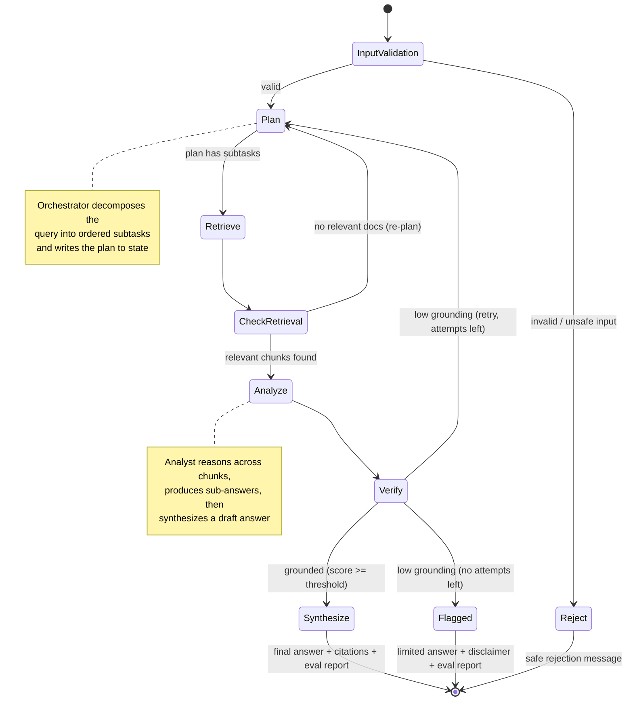
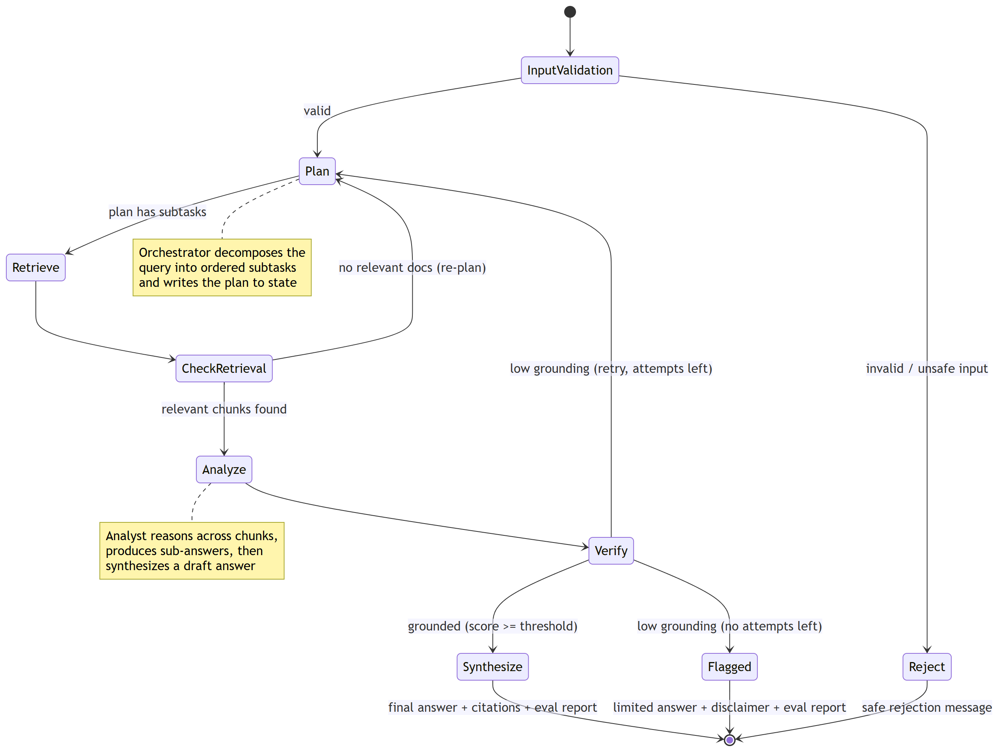
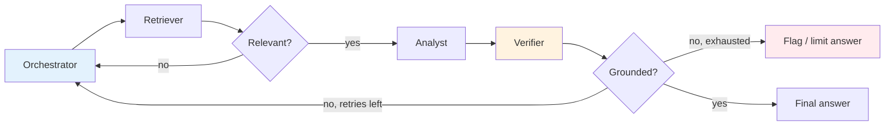
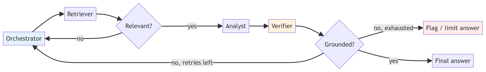

# 2. Agent Flow

This document shows how a single user query travels through the LangGraph state machine, the
decisions made at each node, and where the failure/feedback loops are.

## 2.1 The LangGraph state machine



> Rendered image: [diagrams/02_agent_flow_1.png](diagrams/02_agent_flow_1.png) ([SVG](diagrams/02_agent_flow_1.svg))
>
> 

## 2.2 Step-by-step walkthrough

Take the example query:
> *"Does our remote-work policy conflict with the data-handling rules in the security SOP,
> and what does the vendor contract say about off-site access?"*

This needs **three documents** — exactly the cross-document case the rubric wants.

| Step | Node | What happens | State written |
|------|------|--------------|---------------|
| 1 | **Input Validation** (guardrail) | Check length, injection patterns, on-topic. Passes. | `is_valid=True` |
| 2 | **Orchestrator / Plan** | Decomposes into 3 subtasks: (a) remote-work policy rules, (b) data-handling rules in security SOP, (c) vendor contract off-site clauses. Marks that (a)+(b) must be *compared*. | `plan=[s1, s2, s3]` |
| 3 | **Retriever** | For each subtask, embeds it and pulls top-k chunks from the vector DB with relevance scores + source metadata. | `retrieved={s1:[...], s2:[...], s3:[...]}` |
| 4 | **Check Retrieval** (gate) | If a subtask returned nothing relevant (score < min), flag and route back to re-plan. Here all three returned hits. | `failures=[]` |
| 5 | **Analyst** | Reads chunks per subtask → writes sub-answers. Then reasons across them: compares policy vs SOP, cross-references the contract. Produces a draft answer citing chunk IDs. | `sub_answers`, `draft_answer` |
| 6 | **Verifier** | For each claim in the draft, checks support in cited chunks (NLI-style). Computes grounding score. Suppose 0.87 ≥ 0.75 threshold → pass. | `grounding={score:0.87, unsupported:[]}` |
| 7 | **Synthesize** | Assemble final answer with inline citations `[doc, page]`, attach the evaluation report. | `final_answer`, `trace` complete |
| — | **(return)** | UI shows answer + sources + collapsible decision trace + eval panel. | |

## 2.3 The three control loops (this is what makes it "agentic")



> Rendered image: [diagrams/02_agent_flow_2.png](diagrams/02_agent_flow_2.png) ([SVG](diagrams/02_agent_flow_2.svg))
>
> 

1. **Retrieval gate loop** — irrelevant retrieval bounces back to the Orchestrator to re-plan
   (e.g., reformulate the subtask). Detects *"insufficient or irrelevant retrieval."*
2. **Grounding loop** — a poorly grounded draft triggers a retry with tighter retrieval.
   Detects *"low grounding confidence."*
3. **Bounded retries** — a max-attempts counter prevents infinite loops; on exhaustion the
   system returns a **limited, flagged** answer rather than a hallucinated one. This is
   responsible handling of uncertainty.

## 2.4 Where each User Story is satisfied

| User Story | Satisfied by |
|------------|--------------|
| US1 Complex query handling | Plan → multi-subtask Retrieve → cross-doc Analyze |
| US2 Planning & orchestration | Orchestrator node + conditional edges + trace log |
| US3 Grounded & validated | Verifier node + grounding score + flag-on-low-confidence |
| US4 Explainability | `trace` events + reasoning summaries surfaced in UI |
| US5 Governance & guardrails | Input Validation node + grounding threshold + citations/disclaimers |
| US6 Evaluation & observability | Retrieval scores + grounding checks + failure flags + structured logs |

## 2.5 Decision-trace example (what gets logged)

Every node appends a structured event to `state.trace`, giving the inspectable trail the
rubric asks for:

```json
[
  {"step": 1, "agent": "guardrail",   "action": "validate_input", "result": "pass"},
  {"step": 2, "agent": "orchestrator","action": "plan", "subtasks": 3,
   "detail": ["remote-work rules", "security SOP data rules", "vendor off-site clauses"]},
  {"step": 3, "agent": "retriever",   "action": "retrieve", "subtask": "s2",
   "top_score": 0.82, "chunks": 4, "sources": ["security_sop.pdf p.7"]},
  {"step": 4, "agent": "analyst",     "action": "synthesize", "cited_chunks": ["c12","c30","c44"]},
  {"step": 5, "agent": "verifier",    "action": "ground_check", "score": 0.87,
   "verdict": "pass", "unsupported_claims": []},
  {"step": 6, "agent": "system",      "action": "finalize", "citations": 3}
]
```

Next: [03_implementation_plan.md](03_implementation_plan.md) — the phased build plan.
