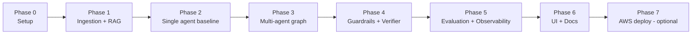
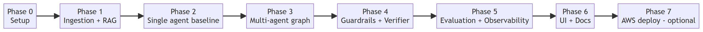

# 3. Implementation Plan

A phased, step-by-step plan to build the system. Each phase ends with something you can run
and verify, so progress is always demonstrable. Estimated effort assumes one developer.

## 3.1 Phases at a glance

> Rendered image: [diagrams/03_implementation_plan_1.png](diagrams/03_implementation_plan_1.png) ([SVG](diagrams/03_implementation_plan_1.svg))
>
> 

---

## Phase 0 — Project setup
**Goal:** a runnable skeleton with config and dependencies.

- [x] Create the repo layout from [01_architecture.md](01_architecture.md#16-proposed-repository-layout).
- [x] `requirements.txt` — langgraph, langchain, langchain-openai, langchain-chroma, chromadb,
      pydantic-settings, python-dotenv, streamlit, pytest, pypdf. Installed into `.venv`.
- [x] `.env.example` with the five `AZURE_OPENAI_*` keys.
- [x] `src/config.py` — settings via `pydantic-settings`, with an `azure_configured()` guard.
- [x] Source documents are in `Policies/` — 13 overlapping Cognizant global HR policy PDFs.
      See [06_corpus_guide.md](06_corpus_guide.md). Exposed as `SOURCE_DOCS_DIR` in config.

**Verified:** imports load; `settings.source_docs_dir` points at `Policies/`.

---

## Phase 1 — Ingestion + retrieval (RAG foundation)
**Goal:** documents are chunked, embedded, and queryable. Targets *Retrieval & RAG Effectiveness (15 pts)*.

- [x] `ingestion/loader.py` — loads PDFs via pypdf, splits with `RecursiveCharacterTextSplitter`
      (800 chars, 120 overlap). Metadata: `source`, `page` (1-indexed), `chunk_id`.
- [x] `ingestion/index.py` — embeds chunks (Azure embeddings) → persists to Chroma in `data/vectorstore/`.
- [x] A `retrieve(query, k)` helper returning chunks **with relevance scores and metadata**.

**Verified:** corpus loads to **13 PDFs → 128 pages → 495 chunks**; 5 loader unit tests pass
offline. The embed/index step (`-m src.ingestion.index --rebuild`) is ready and runs once
Azure credentials are set in `.env`.

---

## Phase 2 — Single-agent baseline
**Goal:** a plain retrieve-then-answer chain to confirm the RAG + LLM wiring works end to end.

- [x] Minimal prompt: question + retrieved context → answer with citations (`src/baseline.py`).
- [x] CLI: `python -m src.app "your question"` (`src/app.py`).
- [x] LLM + retriever are injectable, so the baseline is unit-tested with a mocked LLM.

**Verified:** 4 baseline unit tests pass offline (`src/llm.py` isolates the chat client).
Running it against the *live* model needs Azure creds + a built index. *(This baseline is the
"basic RAG" we deliberately surpass in Phase 3 — kept for comparison.)*

---

## Phase 3 — Multi-agent graph (the core)
**Goal:** the five agents wired into a LangGraph. Targets *Architecture (20)* + *Planning (15)* + *Reasoning (15)*.

- [x] `graph/state.py` — `GraphState` (TypedDict) with `add`-reducer channels for trace/failures/memory.
- [x] `agents/orchestrator.py` — LLM returns a JSON **plan** (list of subtasks), parsed tolerantly
      with a single-subtask fallback (no provider-specific structured-output dependency).
- [x] `agents/retriever.py` — runs Phase 1 retrieval per subtask; writes scores + sources; sets `retrieval_ok`.
- [x] `agents/analyst.py` — cross-document synthesis over evidence grouped by subtask; `+ insufficient_node`.
- [x] `agents/memory.py` — records query/plan/answer into the accumulating `memory` channel.
- [x] `graph/build_graph.py` — nodes + edges + **conditional edges** for the validate gate and the
      retrieval re-plan loop (bounded by `max_retries`).

**Verified:** offline smoke run produces the full trace
(validate → plan[2 subtasks] → retrieve×2 → synthesize → memory); 14 new unit tests pass
(orchestrator, analyst, graph routing incl. re-plan loop and reject path). **23 tests total.**

---

## Phase 4 — Guardrails + Verifier
**Goal:** trust and safety. Targets *Validation, Grounding & Guardrails (15 pts)*.

- [x] `guardrails/input_validation.py` — empty/over-length rejection + prompt-injection
      pattern detection; wired as the graph's entry `validate` node.
- [x] `agents/verifier.py` — claim-level grounding check → `GroundingReport` (score 0–1,
      verdict, unsupported claims); fail-safe to 0.0 on unparseable output.
- [x] `guardrails/grounding.py` — threshold verdict + disclaimer. **Conditional edge**:
      pass → finalize; low + retries left → re-plan; low + exhausted → `limited` (disclaimed).
- [x] Finalize/limited nodes assemble the answer (citations from the Analyst; disclaimer when flagged).

**Verified:** injection/empty/over-length inputs are rejected; low grounding triggers bounded
re-plan then a disclaimed answer with a `low_grounding` flag. 15 new unit tests
(guardrails, verifier, grounding routing). **38 tests total.**

---

## Phase 5 — Evaluation + observability
**Goal:** the system evaluates itself and exposes its decisions. Targets *Evaluation & Observability (10 pts)*.

- [x] `evaluation/tracer.py` — writes each run (query, final answer, full trace, report) to
      `logs/trace_<timestamp>.json`. Nodes already append structured trace events to state.
- [x] `evaluation/metrics.py` — `build_report` captures retrieval relevance (top/mean per
      subtask), grounding score/verdict, failure flags, step count, and agent invocation order;
      `format_report` renders a console summary.
- [x] Evaluation report emitted alongside every answer (printed by the CLI; logged to file).

**Verified:** a run produces a JSON log containing the eval report (retrieval relevance,
grounding, failures) **and** the ordered decision trace. CLI flags: `--trace`, `--no-log`.
4 new unit tests. **42 tests total.**

---

## Phase 6 — UI + documentation (deliverables)
**Goal:** explainability surface + the required written deliverables.

- [x] `ui/streamlit_app.py` — chat input, answer pane, **Sources** expander, **Decision Trace**
      expander, **Evaluation** panel (grounding/subtasks/steps metrics + flags). Sidebar shows
      model/index status and degrades gracefully when unconfigured. Logs each run.
- [x] Diagrams exported to PNG/SVG (`docs/diagrams/`) and embedded in the docs.
- [x] Top-level `README.md` with setup, ingest, run, and test instructions.

**Verified:** `py_compile` clean; full suite (42 tests) still green. Live UI demo needs Azure
creds + a built index (the one remaining credential-gated step).

---

## Phase 7 — AWS deployment (optional, out of grading scope)
**Goal:** document a deployment path even though it isn't graded.

- [ ] Containerize (Dockerfile) the Streamlit app.
- [ ] Deploy to **AWS App Runner** or **ECS Fargate**; store secrets in **AWS Secrets Manager**.
- [ ] Note the steps in `README.md`; deployment is documentation-only for this case study.

---

## 3.2 Suggested build order rationale

We build **RAG first**, then a **single-agent baseline**, *then* the multi-agent graph. This
means you always have a working system to fall back on, and you can directly show reviewers
the jump from "basic RAG chatbot" to "agentic system" — which is the central narrative the
rubric rewards.

## 3.3 Definition of done (per the deliverables list)

- [ ] Application code base — runs locally end to end.
- [ ] Fully functional app — answers a cross-document question with citations.
- [ ] Architecture + agent flow diagram — docs 1 & 2 (+ exported images).
- [ ] Evaluation & guardrail documentation — doc 4.
- [ ] Unit test case documentation — doc 5 + passing `pytest` suite.

Next: [04_evaluation_and_guardrails.md](04_evaluation_and_guardrails.md).
