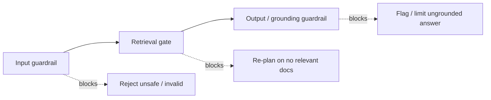
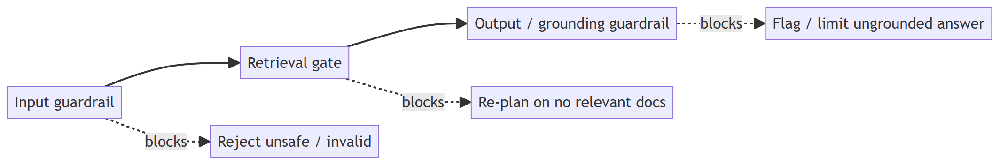

# 4. Evaluation & Guardrail Documentation

This is a required deliverable. It documents how the system stays trustworthy (guardrails)
and how it judges and exposes its own behavior (evaluation & observability). Targets
*Validation, Grounding & Guardrails (15 pts)* and *Evaluation & Observability (10 pts)*.

---

## 4.1 Guardrails

Guardrails operate at three points: **input**, **retrieval**, and **output**.



> Rendered image: [diagrams/04_evaluation_and_guardrails_1.png](diagrams/04_evaluation_and_guardrails_1.png) ([SVG](diagrams/04_evaluation_and_guardrails_1.svg))
>
> 

### 4.1.1 Input validation (entry node)
| Check | Rule | Action on failure |
|-------|------|-------------------|
| Empty / too short | length ≥ 3 meaningful tokens | reject with guidance |
| Too long | length ≤ N chars (e.g. 2000) | truncate or reject |
| Prompt injection | regex/keyword scan for "ignore previous", "system prompt", role-override patterns | strip / reject |
| Off-topic / unsafe | optional lightweight classifier or keyword denylist | refuse politely |

### 4.1.2 Retrieval gate
- If the best relevance score for a subtask `< min_relevance` (e.g. 0.2 cosine, tune per
  embedding model), mark **insufficient retrieval** and route back to the Orchestrator to
  reformulate — rather than answering from nothing.

### 4.1.3 Output / grounding guardrail (Verifier)
- Every claim in the draft answer must be **supported by a cited chunk**.
- A **grounding score** in `[0,1]` is computed (fraction of claims supported, optionally
  weighted by retrieval relevance).
- Threshold policy:
  - `score ≥ 0.75` → return answer with citations.
  - `0.5 ≤ score < 0.75` and retries left → re-plan / re-retrieve.
  - `score < 0.5` or retries exhausted → return a **limited answer + disclaimer**, never a
    confident fabrication.
- Every answer includes **source attribution** (`[filename, page]`) inline and in a sources list.

---

## 4.2 Hallucination control summary

| Technique | How it's applied |
|-----------|------------------|
| Grounded generation | Analyst is prompted to answer **only** from retrieved context and cite chunk IDs. |
| Claim-level verification | Verifier checks each claim against its cited source (NLI-style entailment). |
| Confidence thresholding | Grounding score gates final output. |
| Abstention | On low confidence the system says "insufficient evidence" rather than guessing. |
| Source attribution | Citations let users verify every statement. |

---

## 4.3 Evaluation & observability

The system produces a structured **evaluation report** for every query, logged to file and
shown in the UI.

### 4.3.1 Signals captured
| Signal | Definition | Source |
|--------|-----------|--------|
| Retrieval relevance | top & mean similarity score per subtask | Retriever |
| Grounding score | fraction of supported claims | Verifier |
| Decision trace | ordered list of agent actions + key decisions | Tracer (all nodes) |
| Failure flags | see 4.3.2 | gates + Verifier |
| Latency / step count | wall-clock per node, total steps | Tracer |

### 4.3.2 Failure detection (explicitly required)
| Failure | Detection rule | Response |
|---------|---------------|----------|
| Insufficient / irrelevant retrieval | max relevance < `min_relevance` | re-plan; if persistent, flag in report |
| Low grounding confidence | grounding score < threshold | retry, then flag + limit answer |
| Conflicting agent outputs | two sub-answers contain contradictory claims (Verifier cross-check) | surface the conflict; do not silently pick one |

### 4.3.3 Structured evaluation report (example)

```json
{
  "query": "Does the remote-work policy conflict with the security SOP...?",
  "subtasks": 3,
  "retrieval": [
    {"subtask": "s1", "top_score": 0.78, "mean_score": 0.61, "sources": ["remote_policy.pdf p.2"]},
    {"subtask": "s2", "top_score": 0.82, "mean_score": 0.66, "sources": ["security_sop.pdf p.7"]},
    {"subtask": "s3", "top_score": 0.71, "mean_score": 0.55, "sources": ["vendor_contract.docx p.4"]}
  ],
  "grounding": {"score": 0.87, "verdict": "pass", "unsupported_claims": []},
  "failures": [],
  "steps": 6,
  "latency_ms": 5400
}
```

### 4.3.4 Where it's exposed (observability)
- **Console / file logs** — `logs/trace_<timestamp>.json` per run (decision trace + report).
- **UI panels** — "Decision Trace" and "Evaluation" expanders in Streamlit.
- **Explanation alignment** — the reasoning summary shown to the user is generated from the
  same trace that drives the answer, so the explanation always matches the output.

---

## 4.4 Guardrail & evaluation test matrix

| Scenario | Expected guardrail/eval behavior |
|----------|----------------------------------|
| Prompt-injection input | input guardrail strips/rejects; logged |
| Question with no supporting docs | retrieval gate flags; answer abstains with disclaimer |
| Partially supported answer | grounding score mid-range → retry, then flag |
| Contradictory sources | conflict flag raised; both positions surfaced |
| Well-supported cross-doc question | passes; full answer + citations + eval report |

These scenarios are implemented as tests — see [05_unit_test_plan.md](05_unit_test_plan.md).
